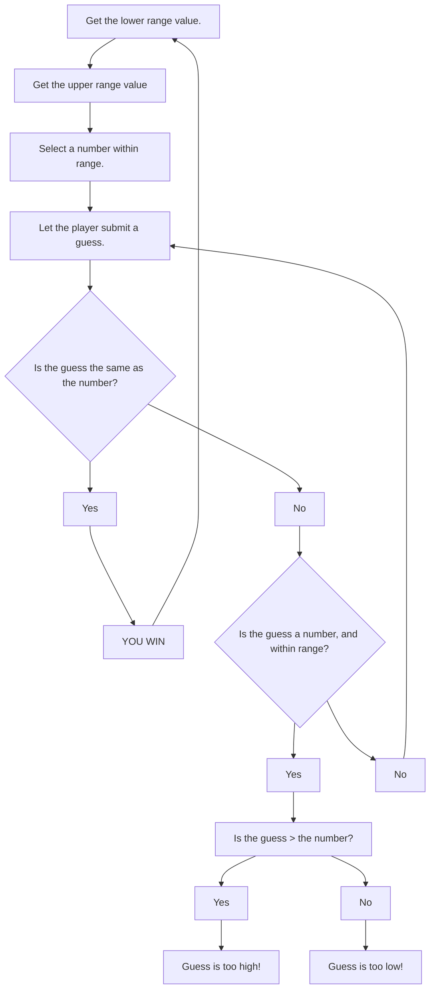

```mermaid
flowchart TD
 A[Get the lower range value.] --> B[Get the upper range value.];
 B[Get the upper range value] --> C[Select a number within range.];
 C[Select a number within range.] --> D[Let the player submit a guess.];
 D[Let the player submit a guess.] --> E@{ shape: diamond, label: "Is the guess the same as the number?" };
 E@{ shape: diamond, label: "Is the guess the same as the number?" } --> E1[Yes];
 E@{ shape: diamond, label: "Is the guess the same as the number?" } --> E2[No];
 E1[Yes] --> Final[YOU WIN];
 Final[YOU WIN] --> A;
 E2[No] --> F@{ shape: diamond, label: "Is the guess a number, and within range?"};
 F@{ shape: diamond, label: "Is the guess a number, and within range?"} --> F1[Yes];
 F@{ shape: diamond, label: "Is the guess a number, and within range?"} --> F2[No];
 F2[No] --> D;
 F1[Yes] --> G[Is the guess > the number?];
 G[Is the guess > the number?] --> G1[Yes];
 G[Is the guess > the number?] --> G2[No];
 G1[Yes] --> H1[Guess is too high!];
 G2[No] --> H2[Guess is too low!];
```
