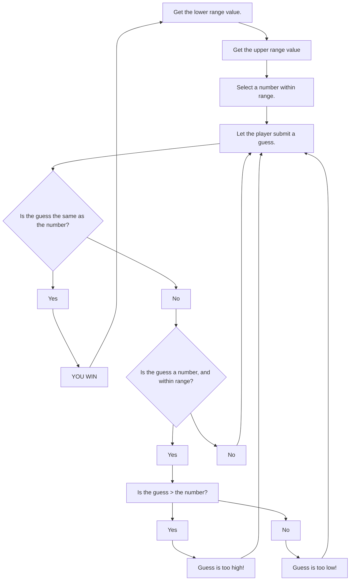

# Flowchart Description
## Above is a basic flowchart that follows the steps to play the number game. First the lower and upper range are set by the user, followed by a guess from the player. From there, the computer determines if the guessed number is the same as the randomly selected one, if it is, then the player is sent back to the start to set a new range for the next game. If the number is incorrect, the program then checks to see if the guess is even a number, and if it is under the max, and over the min. If the guess is invalid, the player is sent back to guess again. If the guess is a number within the range, the program then checks if the guess is > the random selection. If it is greater or lower, the player is notified and then sent back to guess again.
